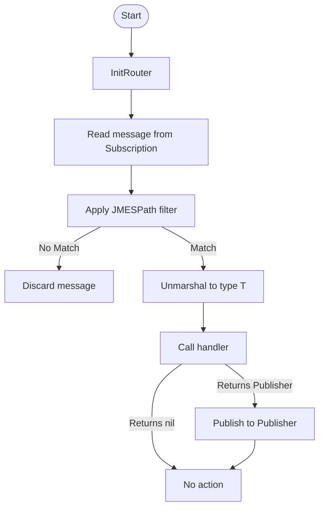

# Event Router - Clean Architecture

## Summary

This project implements an event routing system using Google Cloud Pub/Sub and the Clean Architecture pattern.

## Architecture Overview

- `cmd/server/main.go`: Entry point that registers routes and starts the application.
- `internal/domain`: Interfaces for Subscription, Publisher, and the message model.
- `internal/usecase/router`: Core routing logic including filters and handler dispatching.
- `internal/infrastructure/pubsub`: Pub/Sub-specific Subscriber and Publisher implementations.
- `internal/infrastructure/jmspath`: Logic to filter messages using JMESPath.

## Flow Diagram

