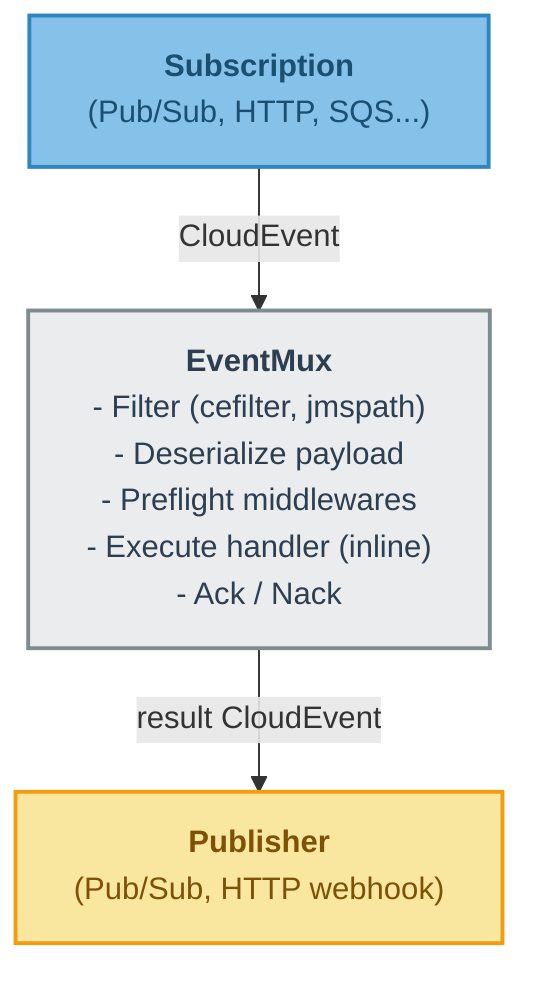
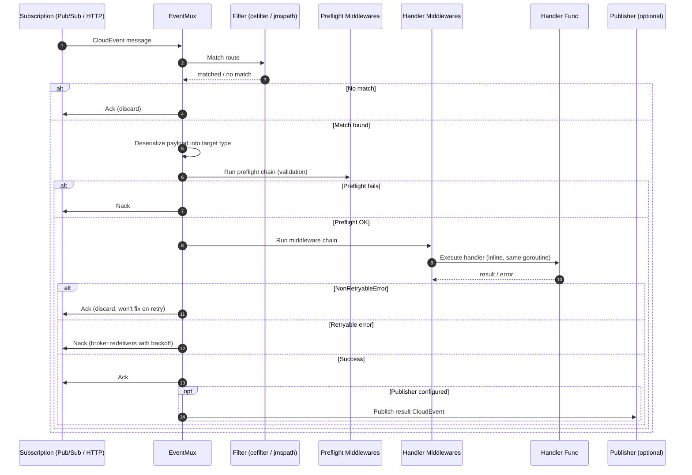
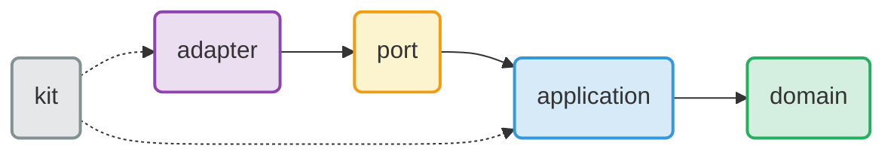

# Event-Driven — CloudEvents Multiplexer Library

A Go library for routing and processing events from multiple sources (Google Cloud Pub/Sub, HTTP, AWS SNS/SQS planned) using the [CloudEvents](https://cloudevents.io/) standard and Clean Architecture.

## Key Features

- **EventMux** — Multiplexes events to handlers based on filters, analogous to `http.ServeMux` for events.
- **CloudEvents native** — `Message` composes `cloudevents.Event` + delivery mechanics (Ack/Nack).
- **Stateless** — No in-memory queue. The broker SDK controls concurrency. Crash-safe by design.
- **Multiple filter types** — CloudEvent attributes (`cefilter`), payload content (`jmspath`), or both combined.
- **Multiple publishers** — Pub/Sub topics, HTTP endpoints (webhooks), or any custom `port.Publisher`.
- **Middleware pipeline** — Recoverer, validation, error ignoring, HTTP retry with jitter.
- **Non-retryable errors** — `domain.NonRetryableError` triggers Ack (discard) instead of Nack (redeliver).
- **Broker-agnostic** — Implement `port.Subscription` and `port.Publisher` for any messaging system.

## Installation

```bash
go get github.com/norlis/event-driven
```

## Quick Start

```go
mux := router.NewEventMux(router.Config{
    Subscription: pubsubSubscription, // or httpSubscription, sqsSubscription, etc.
    Logger:       logger,
})

mux.Use(middlewares.Recoverer)

mux.Register(
    publisher,                                    // where to publish the result (nil = fire-and-forget)
    cefilter.ByType("com.example.order.created"), // filter by CloudEvent type
    Order{},                                      // target struct for deserialization
    router.WrapHandler(orderHandler.Execute),     // typed handler
)

mux.Run(ctx) // blocks until ctx is cancelled
```

## Architecture

```
├── example/                        # Example application using Uber FX
│   ├── cmd/main.go                 # Entry point with FX wiring
│   ├── module.go                   # FX providers (subscriptions, muxes, publishers)
│   ├── events.go                   # Route registration with filters and handlers
│   ├── handlers.go                 # Use case implementations
│   └── configuration.go            # Environment-based configuration
├── pkg/
│   ├── domain/                     # Pure business logic, no external dependencies
│   │   ├── event/
│   │   │   └── message.go          # Message = cloudevents.Event + Ack/Nack + Preflight
│   │   └── errors.go               # Domain errors (NonRetryableError, ErrNoRouteMatched)
│   ├── application/                # Application logic and orchestration
│   │   └── router/                 # EventMux, middlewares, route matching, WrapHandler
│   │       ├── router.go           # EventMux core
│   │       ├── middleware.go       # Middleware type and ChainMiddlewares
│   │       ├── wrap.go             # WrapHandler[T] generic type-safe handler wrapper
│   │       ├── cast.go             # Reflection-based payload deserialization
│   │       ├── metadata/           # Request-scoped key-value store via context
│   │       └── middlewares/        # Built-in middlewares
│   │           ├── recoverer.go    # Panic recovery
│   │           ├── validator.go    # Struct validation (go-playground/validator)
│   │           ├── ignore_errors.go # Suppress specific errors
│   │           └── http_retry.go   # HTTP retry with exponential backoff + jitter
│   ├── port/                       # Interfaces (contracts with the outside world)
│   │   ├── publisher.go            # Publisher: Publish(cloudevents.Event) error
│   │   ├── subscription.go         # Subscription: Start(ctx, handler) error
│   │   └── filter.go               # Filter: Match(*event.Message) bool
│   ├── adapter/                    # Concrete implementations of ports
│   │   ├── pubsub/                 # Google Cloud Pub/Sub (binary + structured content modes)
│   │   │   ├── subscriber.go       # Subscription adapter
│   │   │   ├── publisher.go        # Publisher adapter
│   │   │   └── checker.go          # Health checker
│   │   ├── httpdriven/             # HTTP adapter (CloudEvents SDK for decoding)
│   │   │   ├── subscriber.go       # HTTP → CloudEvent (binary, structured, fallback)
│   │   │   ├── publisher.go        # CloudEvent → HTTP POST (binary content mode)
│   │   │   ├── error.go            # Rule-based HTTP error responder
│   │   │   └── response.go         # JSON response builder
│   │   ├── cefilter/               # CloudEvent attribute filters (ByType, BySource, All)
│   │   └── jmspath/                # JMESPath payload-level filter
│   └── kit/                        # Cross-cutting utilities
│       ├── logger/                 # Structured logger (zap)
│       └── signal/                 # Signal-aware context (SIGINT/SIGTERM)
└── docs/                           # Design documents and proposals
```

## Flow Diagram





## Core Concepts

### Message

`Message` composes `cloudevents.Event` (CNCF v1.0.2) with delivery mechanics that CloudEvents doesn't cover:

```go
type Message struct {
    cloudevents.Event           // Embedded: ID(), Type(), Source(), Data(), Extensions()...
    // + Ack(), Nack()          // Delivery acknowledgment (once-only via sync.Once)
    // + PreflightCallback      // Immediate validation result notification
    // + Context()              // Per-message context, cancelled on Ack/Nack
}
```

### EventMux (formerly Router)

Replaces the previous `Router` + `Dispatcher` + `Worker` architecture. The in-memory job queue (`chan Job`) was eliminated — handlers execute inline in the broker SDK's goroutine.

**Why:** The broker SDK already manages concurrency (`NumGoroutines`, `MaxOutstandingMessages`). The in-memory queue duplicated that responsibility with worse guarantees — messages in `chan Job` were lost on crash.

| Before | After |
|---|---|
| `Router` + `Dispatcher` + `Worker` pool | `EventMux` (stateless, inline) |
| Two concurrency pools (SDK + chan Job) | One pool (broker SDK) |
| Messages lost on crash | Redelivered by broker |
| `router.New(cfg)` | `router.NewEventMux(cfg)` |
| `Config.WorkerDispatcher` required | No dispatcher needed |

### Publisher

`port.Publisher` accepts `cloudevents.Event` directly — no Ack/Nack leaking into outbound messages:

```go
type Publisher interface {
    Publish(cloudevents.Event) error
}
```

Built-in implementations:

| Publisher | Target | Content mode |
|---|---|---|
| `pubsub.GCPPublisher` | Google Cloud Pub/Sub topic | Binary (`ce-*` attributes) |
| `httpdriven.HTTPPublisher` | Any HTTP endpoint | Binary (`Ce-*` headers) |

### Filters

Two filter families, composable via `cefilter.All()`:

```go
// By CloudEvent attribute (no payload parsing)
cefilter.ByType("com.example.order.created", "com.example.order.updated")
cefilter.BySource("//pubsub.googleapis.com/")

// By payload content (JMESPath expression)
jmspath.New("contains(['premium', 'enterprise'], plan)", logger)

// Combined (AND logic)
cefilter.All(
    cefilter.ByType("com.example.order.created"),
    jmspath.New("total > 1000", logger),
)
```

Route matching is **first-match-wins** — order routes from most specific to least specific.

### Error Handling

```go
// Retryable error → Nack → broker redelivers with its own backoff/DLQ policy
return nil, fmt.Errorf("database timeout: %w", err)

// Non-retryable error → Ack (discard) → retrying won't fix it
return nil, domain.NewNonRetryableError(validationErr)
```

For Pub/Sub, configure retry policy and Dead Letter Queue natively in GCP:

```bash
gcloud pubsub subscriptions update my-sub \
  --min-retry-delay=1s --max-retry-delay=60s \
  --dead-letter-topic=my-dlq-topic --max-delivery-attempts=5
```

### HTTP Retry Middleware

For HTTP subscribers where the client is waiting, `HTTPRetryBackoff` retries transient failures in-memory with exponential backoff + jitter:

```go
mux.Use(
    middlewares.HTTPRetryBackoff(200*time.Millisecond, 2*time.Second, 3),
    middlewares.Recoverer,
)
```

Non-retryable errors break the retry loop immediately.

### HTTP Content Modes

The HTTP subscriber accepts CloudEvents in three modes:

| Mode | Content-Type | Attributes | Data |
|---|---|---|---|
| Binary | `application/json` | `Ce-*` headers | HTTP body |
| Structured | `application/cloudevents+json` | Inside JSON body | `data` field in JSON |
| Fallback | `application/json` | Auto-generated defaults | HTTP body |

### WrapHandler

Type-safe generic wrapper that converts `func(ctx, T) → (json.RawMessage, error)` into `HandlerFunc`:

```go
func Execute(ctx context.Context, order Order) (json.RawMessage, error) { ... }

mux.Register(pub, filter, Order{}, router.WrapHandler(handler.Execute))
```

Uses `reflect.TypeFor[T]()` for accurate error messages on type mismatch.

## Architecture Guide

| Layer | Purpose | Contains |
|---|---|---|
| `domain` | Pure business logic | Entities, domain errors, `Message` (CloudEvent + Ack/Nack) |
| `application` | Orchestration | `EventMux`, middlewares, `WrapHandler`, `metadata.Store` |
| `port` | Contracts | `Publisher`, `Subscription`, `Filter` interfaces |
| `adapter` | External world | Pub/Sub, HTTP, cefilter, jmspath implementations |
| `kit` | Cross-cutting tools | Logger, signal-aware context |



## Versioning

```bash
VERSION=v0.2.0
git tag "${VERSION}" && git push origin "${VERSION}"
```

## Concurrency Tuning

Since the EventMux is stateless, concurrency is controlled entirely by the subscription adapter:

| Setting (Pub/Sub) | Controls |
|---|---|
| `NumGoroutines` | Concurrent receive goroutines |
| `MaxOutstandingMessages` | Max messages being processed simultaneously |
| `MaxOutstandingBytes` | Max bytes being processed simultaneously |
| `MaxExtension` | How long the SDK extends the Ack deadline |

For HTTP, concurrency is naturally limited by the goroutine-per-request model.
