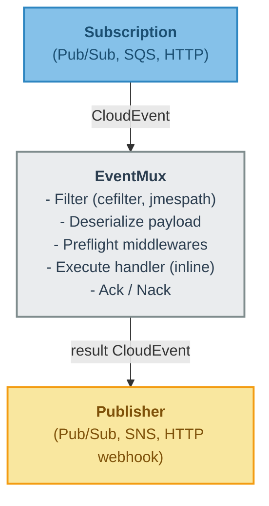
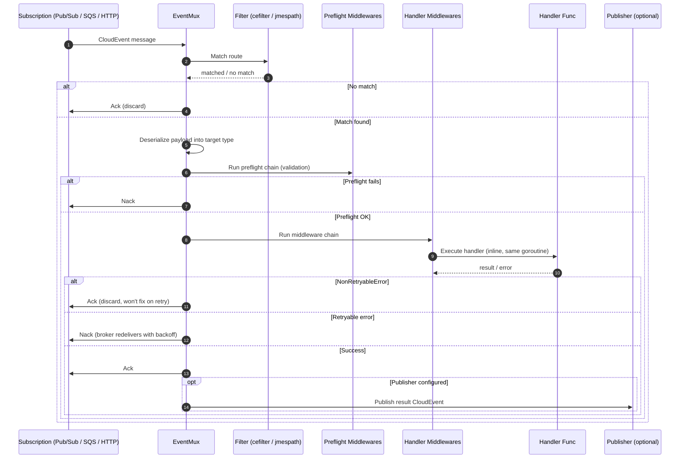

# Event-Driven — CloudEvents Multiplexer Library

A Go library for routing and processing events from multiple sources (Google Cloud Pub/Sub, AWS SNS+SQS, HTTP) using the [CloudEvents](https://cloudevents.io/) standard.

## Key Features

- **EventMux** — Multiplexes events to handlers based on filters, analogous to `http.ServeMux` for events.
- **CloudEvents native** — `Message` composes `cloudevents.Event` with delivery mechanics (Ack/Nack).
- **Stateless** — No in-memory queue. The transport SDK controls concurrency. Crash-safe by design.
- **Multiple transports** — GCP Pub/Sub, AWS SNS (publish) + SQS (subscribe), HTTP (sync). Swappable through `eventmux.Publisher` / `eventmux.Subscription` interfaces.
- **Filter families** — CloudEvent attributes (`cefilter`), payload content (`jmespath`), combinations.
- **Middleware pipeline** — Recoverer, validation, error skipping, HTTP retry with jitter.
- **Pluggable wire format** — `Marshaler` / `Unmarshaler` per transport for FIFO, structured-mode, custom envelopes, encryption, etc.
- **Non-retryable errors** — `event.NonRetryableError` triggers Ack (discard) instead of Nack (redeliver).
- **Structured logging** — `log/slog` across the entire library. No vendor logger dependency.
- **FX integration** — `pkg/kit/fxmux` plugs the mux + FX lifecycle hooks + slog-based fxevent logger.

## Installation

```bash
go get github.com/norlis/event-driven
```

Requires Go 1.26+.

## Quick Start

```go
import (
    "context"

    "github.com/norlis/event-driven/pkg/eventmux"
    "github.com/norlis/event-driven/pkg/filter/cefilter"
    "github.com/norlis/event-driven/pkg/middleware/recover"
    "github.com/norlis/event-driven/pkg/transport/gcp/pubsub"
)

mux := eventmux.New(eventmux.Config{
    Subscription: subscription, // pubsub.Subscriber, sqs.Subscriber, eventhttp.Subscriber, …
    Logger:       logger,       // *slog.Logger
})

mux.Use(recover.Middleware)

mux.Register(
    publisher,                                    // where to publish the result (nil = fire-and-forget)
    cefilter.ByType("com.example.order.created"), // filter by CloudEvent type
    Order{},                                      // target struct for deserialization
    eventmux.Wrap(orderHandler.Execute),          // typed handler
)

mux.Run(ctx) // blocks until ctx is cancelled
```

## Architecture

```
├── example/                            # End-to-end demo wired with Uber FX
│   ├── cmd/main.go                     # FX bootstrap, health endpoints
│   ├── module.go                       # FX providers (clients, muxes, subscriptions)
│   ├── events.go                       # Route registration with filters and handlers
│   └── handlers.go                     # Use-case implementations
└── pkg/
    ├── event/                          # event.Message, event.NonRetryableError, sentinel errors
    ├── eventmux/                       # The mux itself + Publisher/Subscription/Filter contracts
    │   ├── mux.go                      # eventmux.New, Mux, Config, Route
    │   ├── handler.go                  # HandlerFunc, eventmux.Wrap[T]
    │   ├── middleware.go               # Middleware, eventmux.Chain
    │   ├── interfaces.go               # Publisher, Subscription, Filter (consumer-side)
    │   ├── decode.go                   # Reflection-based payload decoding
    │   └── metadata/                   # Per-message key-value store (context-scoped)
    ├── middleware/                     # Built-in middlewares, one package per concern
    │   ├── recover/                    # Panic recovery (recover.Middleware + PanicError)
    │   ├── validate/                   # go-playground/validator on the decoded payload
    │   ├── retry/                      # HTTP retry with exponential backoff + jitter
    │   └── skiperr/                    # Swallow specific errors (predicate-based)
    ├── filter/                         # Filter implementations
    │   ├── cefilter/                   # By CloudEvent type / source / AND composition
    │   └── jmespath/                   # JMESPath expression on the JSON body
    ├── transport/                      # Concrete Publisher / Subscription implementations
    │   ├── gcp/pubsub/                 # Pub/Sub publisher, subscriber, health, marshaler/unmarshaler
    │   ├── aws/                        # Shared AWS SDK config + Identity (region + STS account)
    │   │   ├── sns/                    # SNS publisher + marshaler
    │   │   └── sqs/                    # SQS subscriber + unmarshaler (long-polling + workers)
    │   └── eventhttp/                  # HTTP subscriber + publisher (CloudEvents bindings)
    └── kit/                            # Cross-cutting utilities
        ├── fxmux/                      # FX lifecycle binding + slog fxevent.Logger adapter
        └── signal/                     # Signal-aware context (SIGINT/SIGTERM)
```

> Package-oriented layout (Bill Kennedy style): packages are organized by capability, not by Clean Architecture layer. There is no `domain/`, `application/`, `port/`, or `adapter/` namespace — interfaces live where they are consumed (`eventmux/interfaces.go`).

## Flow Diagram





## Core Concepts

### Message

`event.Message` composes `cloudevents.Event` (CNCF v1.0.2) with delivery mechanics that CloudEvents doesn't cover:

```go
type Message struct {
    cloudevents.Event           // Embedded: ID(), Type(), Source(), Data(), Extensions()...
    // + Ack(), Nack()          // Delivery acknowledgment (once-only via sync.Once)
    // + PreflightCallback      // Immediate validation result notification
    // + Context()              // Per-message context, cancelled on Ack/Nack
}
```

### EventMux

Stateless multiplexer. Handlers execute inline in the broker SDK's goroutine — no in-memory job queue, no second pool of workers. Concurrency is controlled by the transport (`NumGoroutines` for Pub/Sub, `ConsumeWorkers` for SQS, request goroutines for HTTP).

```go
mux := eventmux.New(eventmux.Config{
    Name:            "orders",                // appears in logs
    Subscription:    subscription,
    Logger:          logger,                  // *slog.Logger; default: discard
    ReportOnNoMatch: true,                    // surfaces ErrNoRoute via preflight callback
})
```

### Transports

Every transport package provides at least a `Publisher`, a `Subscriber`, or both. They satisfy `eventmux.Publisher` / `eventmux.Subscription` structurally — no need to import `eventmux` from inside the transport package.

| Package | Publisher | Subscriber | Notes |
|---|---|---|---|
| `pkg/transport/gcp/pubsub` | `pubsub.Publisher` | `pubsub.Subscriber` | + `HealthChecker` for `/ready` probes |
| `pkg/transport/aws/sns` | `sns.Publisher` | — | Pub-only (SNS is fanout) |
| `pkg/transport/aws/sqs` | — | `sqs.Subscriber` | Long-polling, configurable workers |
| `pkg/transport/eventhttp` | `eventhttp.Publisher` | `eventhttp.Subscriber` | Binary + structured + plain JSON |
| `pkg/transport/nats/core` | `core.Publisher` | `core.Subscriber` | Core NATS, native fan-out (no persistence) |
| `pkg/transport/nats/jetstream` | `jetstream.Publisher` | `jetstream.Subscriber` | JetStream, **fan-out via ephemeral consumers** + `HealthChecker` |

The NATS transport is **fan-out**: every running instance receives **every** event — the opposite of SQS competing consumers (where one instance per message wins). This is the model to use when all instances must react to the same events (cache invalidation, config refresh, broadcast).

- **`core`** — a plain `Subscribe` (empty `QueueGroup`) delivers to all subscribers. No persistence: events arriving while an instance is down are lost. Ack/Nack are no-ops
- **`jetstream`** — each instance creates its **own ephemeral consumer** on a shared stream with `DeliverPolicy=New`.
  Every instance gets every new event; the consumer is auto-created at startup and auto-removed (`InactiveThreshold`) when the instance dies. Within a live instance, a failed handler `Nak`s and the message is redelivered. Events arriving while an instance is **down** are missed by that instance (by design).

Provisioning: the **stream** is assumed to exist in production (created by IaC/ the `nats` CLI); set `AutoProvisionStream: true` (with a `StreamConfig`) for
local/dev. Per-instance **consumers** are always auto-created at runtime. Use `jetstream.NewHealthChecker(js, jetstream.WithStreams("ORDERS"))` for `/ready`.

> **Need work-queue (one instance per message) instead?**
> That is a future additive change — a `Durable` field on `jetstream.SubscriberConfig` switches  to a shared durable consumer.

**AWS Identity helper** — instead of hardcoding region/account, `aws.Identity{Config: awsCfg}` derives them automatically (region from `awsCfg.Region`, account via `sts:GetCallerIdentity`, cached). Pass topic/queue names instead of full ARNs/URLs:

```go
awsCfg, _ := aws.NewConfig()
identity := &aws.Identity{Config: awsCfg}

pub, _ := sns.NewPublisher(snsClient, sns.PublisherConfig{
    Topic:    "orders",        // → arn:aws:sns:<region>:<account>:orders
    Identity: identity,
}, logger)

sub, _ := sqs.NewSubscriber(sqsClient, sqs.SubscriberConfig{
    Queue:    "orders",        // → https://sqs.<region>.amazonaws.com/<account>/orders
    Identity: identity,        // STS lookup is cached and shared with SNS
}, logger)
```

ARNs / URLs already qualified are accepted unchanged — the resolver detects the prefix (`arn:` for SNS, `https://` for SQS) and skips STS entirely.

### Marshaler / Unmarshaler

Each transport exposes pluggable wire-format mapping:

| Transport | Default behavior |
|---|---|
| `pubsub.DefaultMarshaler` / `DefaultUnmarshaler` | Binary mode (`ce-*` attributes). Unmarshaler auto-detects `Content-Type: application/cloudevents+json` for structured mode. |
| `sns.DefaultMarshaler` | CE attrs → `MessageAttributes` (String). |
| `sqs.DefaultUnmarshaler` | Reads `ce-*` from `MessageAttributes`. Assumes `RawMessageDelivery=true` for SNS→SQS fan-out. |
| `eventhttp` | Uses the official CloudEvents SDK (`cehttp.NewEventFromHTTPRequest`); not pluggable here. |

Swap to support FIFO (`MessageGroupId`/`MessageDeduplicationId`), structured-mode publishing, legacy formats, encryption, compression, etc.

### Filters

Two filter families, composable:

```go
// CloudEvent attribute filters (no payload parsing)
cefilter.ByType("com.example.order.created", "com.example.order.updated")
cefilter.BySource("//pubsub.googleapis.com/")

// Payload-level filter (JMESPath on JSON body)
jmespath.New("contains(['premium', 'enterprise'], plan)", logger)

// Combined (AND)
cefilter.All(
    cefilter.ByType("com.example.order.created"),
    jmespath.New("total > `1000`", logger),
)
```

Route matching is **first-match-wins** — register routes from most specific to least specific.

### Middleware

```go
import (
    "github.com/norlis/event-driven/pkg/middleware/recover"
    "github.com/norlis/event-driven/pkg/middleware/validate"
    "github.com/norlis/event-driven/pkg/middleware/retry"
    "github.com/norlis/event-driven/pkg/middleware/skiperr"
)

mux.Use(recover.Middleware)                               // recover panics
mux.UsePreflight(validate.New(logger))                    // go-playground/validator before handler
mux.Use(retry.HTTPBackoff(200*time.Millisecond, 2*time.Second, 3))
mux.Use(
    skiperr.New(logger,
        skiperr.ByErr("not-found", ErrDataNotFound),
        skiperr.ByType[validator.ValidationErrors]("validator"),
    ).Middleware,
)
```

`Use` chains the handler middleware. `UsePreflight` runs before the handler against a no-op terminal — used to surface validation/authorization failures without invoking the user handler.

### Error Handling

```go
// Retryable → Nack → broker redelivers with its own backoff/DLQ policy
return nil, fmt.Errorf("database timeout: %w", err)

// Non-retryable → Ack (discard) → retrying won't fix it
return nil, event.NewNonRetryableError(validationErr)
```

For Pub/Sub, configure retry policy and Dead Letter Queue natively in GCP:

```bash
gcloud pubsub subscriptions update my-sub \
  --min-retry-delay=1s --max-retry-delay=60s \
  --dead-letter-topic=my-dlq-topic --max-delivery-attempts=5
```

For SQS, configure `VisibilityTimeout` and `RedrivePolicy` on the queue. The `sqs.Subscriber` leaves nacked messages untouched so the visibility timeout drives redelivery.

### HTTP Content Modes

The HTTP subscriber accepts CloudEvents in three modes:

| Mode | Content-Type | Attributes | Data |
|---|---|---|---|
| Binary | `application/json` | `Ce-*` headers | HTTP body |
| Structured | `application/cloudevents+json` | Inside JSON body | `data` field in JSON |
| Fallback | `application/json` | Auto-generated defaults | HTTP body |

### eventmux.Wrap

Type-safe generic wrapper that converts `func(ctx, T) → (json.RawMessage, error)` into `HandlerFunc`:

```go
func Execute(ctx context.Context, order Order) (json.RawMessage, error) { ... }

mux.Register(pub, filter, Order{}, eventmux.Wrap(handler.Execute))
```

Uses `reflect.TypeFor[T]()` for accurate error messages on type mismatch.

## Logging (slog)

The library uses `log/slog` exclusively. Construct a logger however you want and pass it in:

```go
import "log/slog"
import "os"

logger := slog.New(slog.NewJSONHandler(os.Stdout, &slog.HandlerOptions{Level: slog.LevelInfo}))
```

Nil loggers are accepted and default to `slog.DiscardHandler`. The library does **not** ship a logger factory — `slog.New(...)` is one line.

## FX Integration

`pkg/kit/fxmux` provides:

- **`fxmux.Bind(lc, mux, logger, shutdowner)`** — hooks `mux.RunBackground` to `fx.Lifecycle.OnStart` and triggers `fx.Shutdowner` on fatal mux errors.
- **`fxmux.NewLogger(*slog.Logger) fxevent.Logger`** — pipes FX events to slog. Only Started / Stopping / errors get logged; the verbose Provide/Invoke/Hook chatter is silenced.

```go
fx.New(
    fx.WithLogger(fxmux.NewLogger),
    fx.Provide(NewLogger, NewMux, NewSubscription, ...),
    fx.Invoke(RegisterEventHandlers),
)
```

See `example/cmd/main.go` for a complete wiring.

## Versioning

```bash
VERSION=v0.3.0
git tag "${VERSION}" && git push origin "${VERSION}"
```

## Concurrency Tuning

Since EventMux is stateless, concurrency is controlled by the transport:

| Transport | Knob | Controls |
|---|---|---|
| GCP Pub/Sub | `NumGoroutines` | Concurrent receive goroutines (SDK) |
| GCP Pub/Sub | `MaxOutstandingMessages` | Max in-flight messages |
| GCP Pub/Sub | `MaxExtension` | How long the SDK extends the ack deadline |
| AWS SQS | `ConsumeWorkers` | Parallel polling goroutines |
| AWS SQS | `WaitTimeSeconds` (in `GenerateReceiveMessageInput`) | Long-polling window (max 20s) |
| AWS SQS | Queue `VisibilityTimeout` | How long a message is hidden after receive |
| HTTP | — | One goroutine per HTTP request (Go runtime) |

## Example

A full end-to-end example lives under `example/` showing four cross-transport scenarios (HTTP↔Pub/Sub round-trip, JMESPath filtering, validation preflight). See [`example/README.md`](example/README.md) for the env vars and `example/test.http` for ready-to-fire requests.
