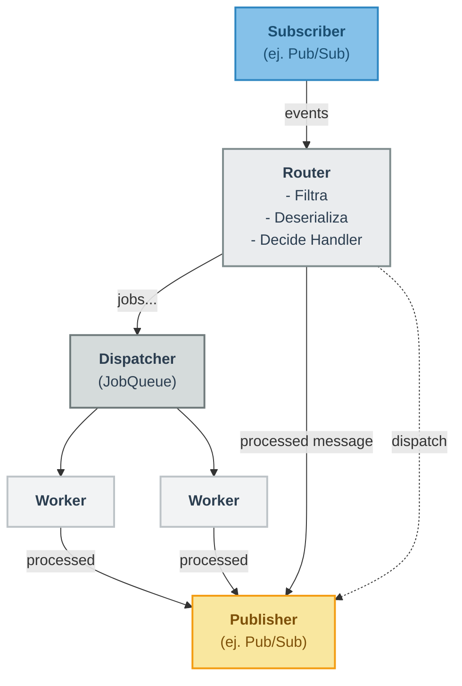
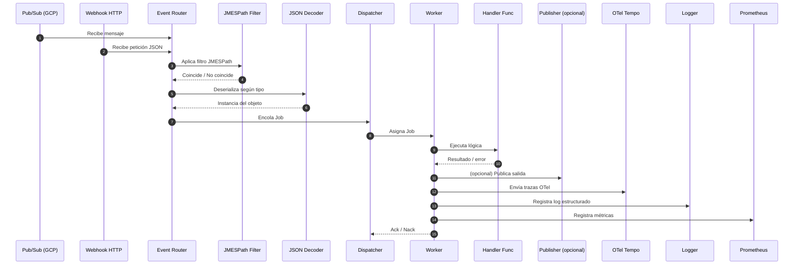

# Event Router - Clean Architecture

## Summary

This project implements an event routing system using Google Cloud Pub/Sub and the Clean Architecture pattern.

## Architecture Overview

- `cmd/server/main.go`: Entry point that registers routes and starts the application.
- `pkg/domain`: Interfaces for Subscription, Publisher, and the message model.
- `pkg/usecase/router`: Core routing logic including filters and handler dispatching.
- `pkg/infrastructure/pubsub`: Pub/Sub-specific Subscriber and Publisher implementations.
- `pkg/infrastructure/jmspath`: Logic to filter messages using JMESPath.

```

├── go.mod
├── go.sum
├── domain/
│   ├── message.go
│   └── ...
├── infrastructure/
│   ├── pubsub/
│   │   ├── publisher.go
│   │   └── subscriber.go
│   └── jmspathfilter/
│       └── filter.go
├── router/
│   ├── router.go
│   └── ...
├── worker/
│   ├── worker.go
│   └── dispatcher.go
└── logger/ // (decidir incluirlo en la librería)
└── otelsetup/ // (decidir incluirlo en la librería)
```

## Flow Diagram

**version compacta**


**sequenceDiagram**




## Versioning

```shell
VERSION=v0.1.1
git tag "${VERSION}" && git push origin "${VERSION}"
```

## Consideraciones de rendimiento 

- Pub/Sub `MaxOutstandingMessages` (`Dispatcher QueueSize + Dispatcher NumWorkers`) y `NumGoroutines` (en `SubscriberConfig` de `messaging.NewSubscription`):
  - `MaxOutstandingMessages`: El número máximo de mensajes que la librería cliente de Pub/Sub mantendrá en memoria sin haberles hecho ACK/NACK. Si tu `JobQueue` se llena, y el `Router` Nackea mensajes, estos volverán a contar contra este límite eventualmente.
  - `NumGoroutines` (en `ReceiveSettings` del cliente Pub/Sub, que messaging.NewSubscription debería usar): Controla cuántas goroutines usa la librería cliente para recibir mensajes y llamar a tu callback (el que tienes en Router.Run). Un valor demasiado bajo aquí será un cuello de botella antes de que los mensajes lleguen a tu `JobQueue`.

- Dispatcher `NumWorkers` y `QueueSize` (en `DispatcherConfig`):
  - `NumWorkers`: Tu capacidad de procesamiento real.
  - `QueueSize`: Un buffer para absorber picos de mensajes.