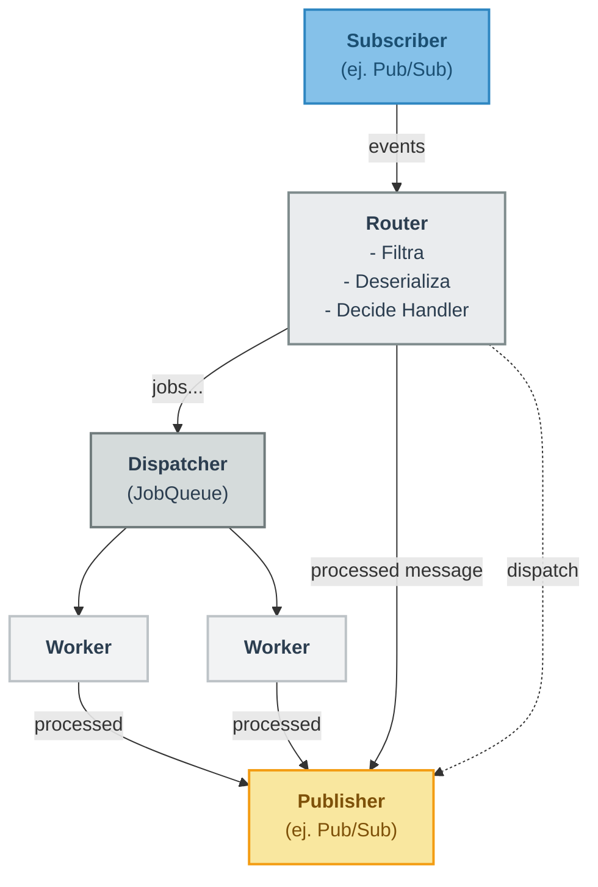
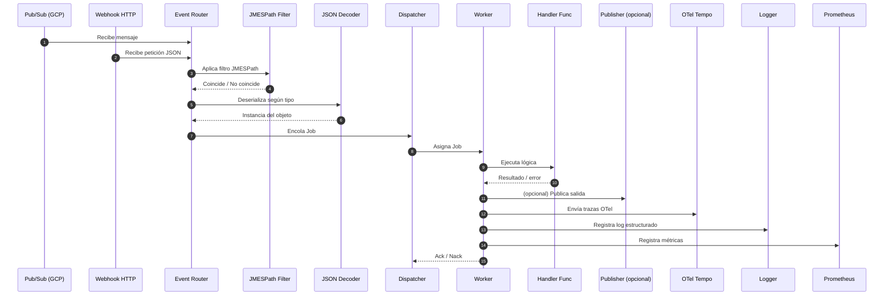
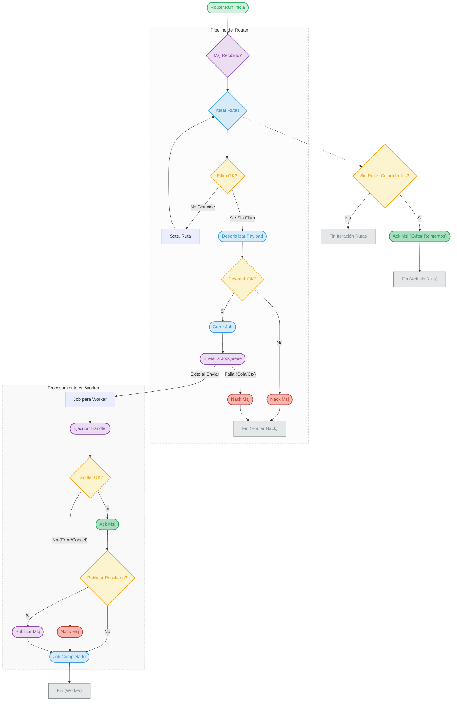
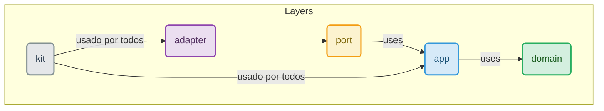

# Event Router - Clean Architecture

## Summary

This project implements an event routing system using Google Cloud Pub/Sub and the Clean Architecture pattern.

## Environment Variables

Set the following variables to configure the example application:

- `GCP_PROJECT_ID` – Google Cloud project identifier.
- `EVT_APP_SUBSCRIPTION` – Pub/Sub subscription from which application events are received.
- `EVT_TRACE_SUBSCRIPTION` – Pub/Sub subscription used for receiving trace messages.
- `EVT_PUBLISH_TRACE_TOPIC` – Topic where processed trace information is published.

```shell
go run cmd/server/main.go 
```

## Architecture Overview

```
├── go.mod
├── go.sum
├── cmd/
│   └── server/
│       ├── main.go                 # Punto de entrada, configuración de Fx, gestión del ciclo de vida.
│       └── example/                # Módulo de ejemplo que ensambla la aplicación.
│           ├── module.go           # Providers de Fx para todas las dependencias.
│           ├── events.go           # Registro de rutas y handlers para los routers.
│           ├── handlers.go         # Implementación de los casos de uso (lógica de negocio).
│           └── configuration.go    # Carga y estructuración de la configuración.
├── pkg/
│   ├── domain/                     # Lógica y tipos de negocio puros. No depende de nada externo.
│   │   ├── event/
│   │   │   └── event.go            # Definición del sobre del evento (antes message.go).
│   │   └── error.go                # Errores de dominio.
│   ├── application/                # Lógica de aplicación que orquesta el flujo de datos.
│   │   ├── router/                 # Lógica central del router, middlewares y registro de rutas.
│   │   └── worker/                 # Implementación del dispatcher y los workers concurrentes.
│   ├── port/                       # Interfaces (Puertos) que definen los contratos con el exterior.
│   │   ├── publisher.go
│   │   ├── subscriber.go
│   │   └── filter.go
│   ├── adapter/                    # Implementaciones concretas (Adaptadores) de los puertos.
│   │   ├── gcppubsub/              # Adaptador para Google Cloud Pub/Sub.
│   │   ├── http/                   # Adaptador para recibir eventos vía HTTP.
│   │   └── jmspath/                # Adaptador para el filtrado con JMESPath.
│   └── kit/                        # "Tool-kit" con utilidades transversales para la aplicación.
│       ├── logger/                 # Configuración del logger estructurado (zap).
│       └── otelsetup/              # Configuración del tracing con OpenTelemetry.
├── deployments/                    # Archivos de despliegue (Docker, K8s, etc.).
└── tools/                          # Herramientas de desarrollo y CI/CD.

```

### Flow Diagram

**version compacta**


**sequenceDiagram**





## Versioning

```shell
VERSION=v0.1.1
git tag "${VERSION}" && git push origin "${VERSION}"
```

## Consideraciones de rendimiento 
https://medium.com/smsjunk/handling-1-million-requests-per-minute-with-golang-f70ac505fcaa

- Pub/Sub `MaxOutstandingMessages` (`Dispatcher QueueSize + Dispatcher NumWorkers`) y `NumGoroutines` (en `SubscriberConfig` de `messaging.NewSubscription`):
  - `MaxOutstandingMessages`: El número máximo de mensajes que la librería cliente de Pub/Sub mantendrá en memoria sin haberles hecho ACK/NACK. Si tu `JobQueue` se llena, y el `Router` Nackea mensajes, estos volverán a contar contra este límite eventualmente.
  - `NumGoroutines` (en `ReceiveSettings` del cliente Pub/Sub, que messaging.NewSubscription debería usar): Controla cuántas goroutines usa la librería cliente para recibir mensajes y llamar a tu callback (el que tienes en Router.Run). Un valor demasiado bajo aquí será un cuello de botella antes de que los mensajes lleguen a tu `JobQueue`.

- Dispatcher `NumWorkers` y `QueueSize` (en `DispatcherConfig`):
  - `NumWorkers`: Tu capacidad de procesamiento real.
  - `QueueSize`: Un buffer para absorber picos de mensajes.

## OPA server

```shell
opa run --server policy.rego

```


## Guía Rápida de Arquitectura: ¿Dónde va mi código?

### `domain` (_El Corazón️_):
- ¿Qué es? La lógica pura de tu negocio.

- ¿Qué pongo? Entidades (Order, User), reglas de negocio (order.AddItem()) y eventos de dominio (OrderCreated).

> Regla clave: No depende de NADA. Cero librerías externas.

### `application` (_El Cerebro_):
- ¿Qué es? El orquestador que dirige a la lógica de negocio.

- ¿Qué pongo? Los casos de uso (handlers), el Router que decide qué handler llamar y el Worker que procesa en segundo plano.

> Regla clave: Usa el domain para hacer el trabajo y llama a las interfaces de port para hablar con el exterior.

### `port` (_El Contrato_):
- ¿Qué es? Las "interfaces" de Go. Define qué necesita la aplicación del mundo exterior, pero no el cómo.

- ¿Qué pongo? Solo interface { ... }. (Ej: Publisher, Subscription).

> Regla clave: Es el enchufe. No tiene código de implementación.

### `adapter` (*El Traductor*):
- ¿Qué es? El código que conecta tu aplicación con el mundo real (HTTP, Pub/Sub, bases de datos).

- ¿Qué pongo? La implementación de las interfaces de port. (Ej: GcpPubSubPublisher, HttpSubscriber).

> Regla clave: Es el cable que se conecta al enchufe (port). Aquí viven las librerías externas.

### `kit` (_La Caja de Herramientas️_):
¿Qué es? Utilidades que ayudan a toda la aplicación.

¿Qué pongo? logger y otelsetup (tracing).

> Regla clave: Es código de soporte, no es lógica de negocio ni un adaptador


### Resumen



| Directorio    | Propósito Principal                        | ¿Qué Pongo Aquí?                                                                 | Ejemplo Concreto                                                                           |
|---------------|--------------------------------------------|----------------------------------------------------------------------------------|--------------------------------------------------------------------------------------------|
| `domain`      | El Corazón del Negocio                     | Entidades, Eventos de Dominio, Lógica de Negocio pura.                          | `struct Order`, `func (o *Order) AddItem(...)`                                             |
| `application` | El Orquestador de Casos de Uso             | Lógica de aplicación que coordina el flujo. `Router`, `Worker`, `Handlers`.     | `OrderHandler` que llama al repositorio y al publicador.                                  |
| `port`        | El Contrato con el Exterior                | Interfaces de Go (`type MyInterface interface { ... }`).                        | `type Publisher interface { ... }`                                                         |
| `adapter`     | La Implementación del Mundo Real           | Código que implementa los puertos usando tecnología concreta (HTTP, Pub/Sub, SQL). | `GcpPubSubPublisher`, `HttpSubscriber` que maneja `http.Request`.                         |
| `kit`         | La Caja de Herramientas                    | Utilidades transversales y de soporte.                                           | `logger/New()`, `otelsetup/InitTracerProvider()`                                          |
